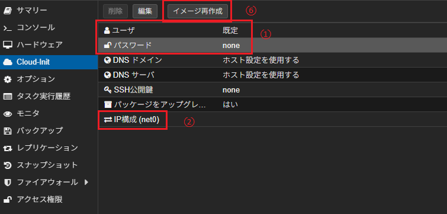
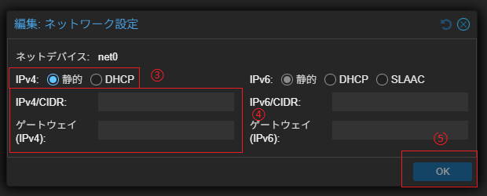

# TerraformとAnsibleを使用した、ProxmoxのVM自動構築

## 目次
- [はじめに](#はじめに)
- [前提条件](#前提条件)
- [ディレクトリ構成](#ディレクトリ構成)
- [SSH鍵の作成](#ssh鍵の作成)
- [proxmoxにVMテンプレートを作成](#proxmoxにvmテンプレートを作成)
- [Terraform実行ユーザ設定](#terraform実行ユーザ設定)
- [Terraformの変数を設定](#terraformの変数を設定)


## はじめに

TerraformとAnsibleを使用した、ProxmoxのVM自動構築のテンプレート。  
VMのリソース管理はTerraformで実施し、パッケージインストール等はAnsibleで実施する。  
本テンプレートではUbuntu22.04にdockerの実行環境を構築する。  
状況に応じて適宜修正して下さい。

## 前提条件
* Terraformをインストール済みであること  
    Terraformのインストール方法は下記を参照  
    https://developer.hashicorp.com/terraform/install
* Ansibleサーバが構築済みであること

## ディレクトリ構成

```
./
├──/.ssh
|   └──id_rsa ※事前に鍵を作成し格納する
|   └──id_rsa.pub ※事前に鍵を作成し格納する
├──/ansible
|   ├──/inventory
|   |   └──hosts.ini ※Terraformで自動作成
|   ├──/roles
|   |   ├──/docker
|   |   |   ├──/tasks
|   |   |       └──main.yml ※dockerのインストール
|   |   ├──/ubuntu-setup
|   |       ├──/tasks
|   |           └──main.yml ※初期セットアップ
|   └──site.yml ※playbooks
└──/terraform
    ├──docker-vm.tf ※VMのリソース情報
    ├──provider.tf ※proxmoxのプロバイダ設定
    ├──terraform.tfvars ※変数を定義
    └──variables.tf ※変数を宣言
```

## SSH鍵の作成  
SSH鍵の作成方法  
※Windowsの場合
```
ssh-keygen -t rsa -b 4096
```

```txt:Output
Generating public/private ecdsa key pair.
Enter file in which to save the key (C:\Users\username/.ssh/id_rsa):※Enter
Enter passphrase (empty for no passphrase):※Enter
Enter same passphrase again:※Enter
Your identification has been saved in C:\Users\username/.ssh/id_rsa.
Your public key has been saved in C:\Users\username/.ssh/id_rsa.pub.
The key fingerprint is:
SHA256:OIzc1yE7joL2Bzy8!gS0j8eGK7bYaH1FmF3sDuMeSj8 username@LOCAL-HOSTNAME

The key's randomart image is:
+--[RSA 4096]--+
|        .        |
|         o       |
|    . + + .      |
|   o B * = .     |
|   o= B S .      |
|   .=B O o       |
|  + =+% o        |
| *oo.O.E         |
|+.o+=o. .        |
+----[SHA256]-----+
```

## proxmoxにVMテンプレートを作成
1. proxmoxノードのシェルで下記コマンドを実行
```bash:proxmox
wget https://cloud-images.ubuntu.com/jammy/current/jammy-server-cloudimg-amd64.img
qm create 9000 --memory 8192 --net0 virtio,bridge=vmbr0 --scsihw virtio-scsi-pci
qm set 9000 --scsi0 local-lvm:0,import-from=/root/jammy-server-cloudimg-amd64.img
qm set 9000 --ide2 local-lvm:cloudinit
qm set 9000 --boot order=scsi0
qm set 9000 --serial0 socket --vga serial0
```
2. コマンドを実行後、ID9000のVMが作成されている為、左のメニューからCloud-initを選択し、下記設定を実施する  
①初期ユーザ、パスワードを設定する  
②IP構成を編集  
③静的を選択  
④IPアドレス、ゲートウェイアドレスを設定  
⑤OKを選択  
⑥イメージ再作成を選択  


3. VMにログイン確認。問題なくログイン出来ればOK
4. proxmoxノードのシェルで下記コマンドを実行し、VMをテンプレート化
```bash:proxmox
qm set 9000 --name Ubuntu2204-template
```

## Terraform実行ユーザ設定
1. proxmoxノードのシェルで下記コマンドを実行。最後にトークンが発行される為、控えておく  
※パスワードは適宜変更する。
```bash:proxmox
pveum role add TerraformProv -privs "Datastore.AllocateSpace Datastore.AllocateTemplate Datastore.Audit Pool.Allocate Sys.Audit Sys.Console Sys.Modify VM.Allocate VM.Audit VM.Clone VM.Config.CDROM VM.Config.Cloudinit VM.Config.CPU VM.Config.Disk VM.Config.HWType VM.Config.Memory VM.Config.Network VM.Config.Options VM.Migrate VM.Monitor VM.PowerMgmt SDN.Use"
pveum user add terraform-prov@pve --password password
pveum aclmod / -user terraform-prov@pve -role TerraformProv
pvesh create /access/users/terraform-prov@pve/token/sample --privsep 0
```
```txt:token-output
┌──────────────┬──────────────────────────────────────┐
│ key          │ value                                │
╞══════════════╪══════════════════════════════════════╡
│ full-tokenid │ terraform-prov@pve!sample            │
├──────────────┼──────────────────────────────────────┤
│ info         │ {"privsep":"0"}                      │
├──────────────┼──────────────────────────────────────┤
│ value        │ token-secret                         │
└──────────────┴──────────────────────────────────────┘
```

## Terraformの変数を設定
1. 『terraform.tfvars』に変数値を定義していく
```
# provider設定
pm_url            = "[proxmoxのAPI URL]"
pm_user_token_id  = "[proxmoxのユーザー名]@[認証方式]![proxmoxのユーザートークンID]"
pm_token_secret   = "[proxmoxのユーザートークンシークレット]"

# vm設定
pm_node_name     = "[proxmoxのノード名]"
vm_name = "[VMの名前]"
vm_template = "[VMテンプレート名]"
vm_bridge  = "[VMのブリッジ名]"
vm_searchdomain = "[VMの検索ドメイン名]"
vm_nameserver = "[VMのDNSサーバーのIPアドレス]"
vm_ip      = "[VMの固定IPアドレス]"
vm_cidr    = "[サブネットマスクのCIDR表記 (例: 24)]"
vm_gateway = "[ゲートウェイアドレス]"
vm_username = "[VMのユーザー名]"
vm_password = "[VMのパスワード]"

# ansible設定
ansible_server_password = "[ansibleサーバーのパスワード]"
ansible_server_user = "[ansibleサーバーのユーザー名]"
ssh_private_key_path = "[実行ホストのSSH秘密鍵のパス]"
ansible_server_ip = "[ansibleサーバーのIPアドレス]"
```
2. 変数を設定後、terraformディレクトリ内で下記コマンドを実施。エラーが出なければOK
```
terrafom init
```
3. 次に下記コマンドを実施。エラーが出なければOK
```
terraform plan 
```
4. 最後に次に下記コマンドを実施。Apply complete!と表示されれば構築が完了する。
```
terraform apply 
```
おまけ  
不要となったら下記コマンドで削除
```
terraform destroy
```